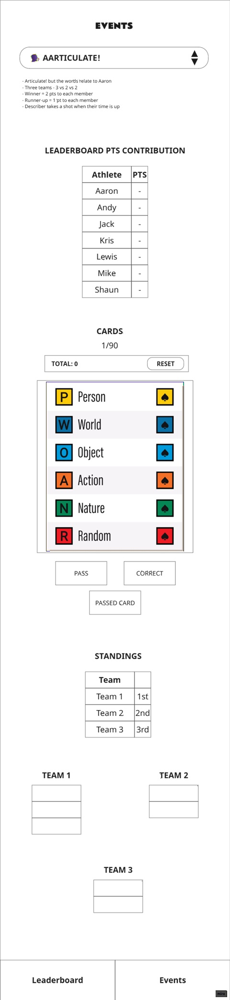

# AARTICULATE! event

## UI Mockup

## Leaderboard Consequences

Each member of the winning team gets 2pts.

Each member of the 2nd placed team gets 1pt.

## Sections

### Instructions String

>- Aarticulate!
>- Three teams - 3 vs 2 vs 2
>- Winner = 2 pts to each member
>- Runner-up = 1 pt to each member

### LEADERBOARD POINTS CONTRIBUTION

* Table displaying final points after the standings have been updated.
* Automatically populated based on the standings.
* Use the standings and teams, once configured, to allocated points to members in each team.
* Give 2pts to each member of the team in 1st position of the standings.
* Give 1pt to each member of the team in 2nd position of the standings.
  
### CARDS

This section functions as a helper for the Articulate! board game, displaying the cards the players have to describe from and other features.

Card deck should be shuffled (randomised) when the page is reloaded.

* Deck counter: how many cards of the deck have been used up. Displayed as "1/90". Where 1 is the current number of cards that have been seen and 90 is the total in the deck.
* Turn score counter and reset button: Incremented each time the correct button is pressed. Reset button resets the count to 0 (to be used between turns), clears the stored passed card, and re-enables the pass button if disabled.
* Card display: show each card and its words for each category. Same template as the original Articulate card. Cards generated from array in ../src/aarticulate.json. See mockup.
* PASS button: To skip to the next card without incrementing score. Can be used once per turn. When pressed, button is disabled and the passed card is stored.
* CORRECT button: Press when guesser guesses correctly. On press, display next card and increment score counter.
* PASSED CARD button: Press to display passed card. If CORRECT pressed on passed card then display the next card, clear the stored passed card and re-enable the pass button.

### STANDINGS

A simple table with three rows - 1st, 2nd and 3rd place.

Each Team cell is a dropdown to select from the team names as set in the section below.

### TEAMS

Three tables, 1 for each team.

1 table of three members, and 2 tables of two members.

The team names are renamable by the admin user.

The data source for the team name drop downs in the standings table is the team names set for each table.

Each team member cell is a drop down for selecting player names.