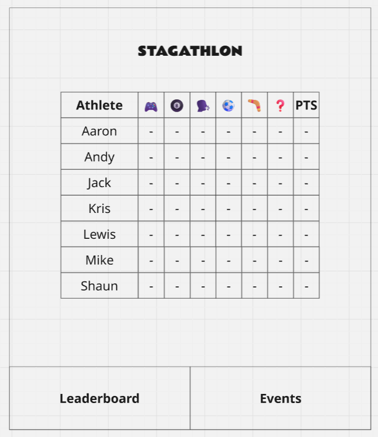

# Stagathlon

## Overview

Stagathlon is a PWA for tracking a weekend long olympics-style competition during a stag party.

It consists of two main sections - Leaderboard and Events - and event subscreens.

It features persistent navigation buttons at the bottom of each screen for switching between the leaderboard and events section.

## User roles

One user is Admin and has write access to most fields. All others are RO.

All users see the same info and can view all screens but only the admin can edit.

## Main sections

The app consists of two main sections:

### Leaderboard

The homepage. A screen with a table displaying the per-event points totals and overall points totals, for each athlete.

The points are automatically calculated and entered based on the results of the events and the data entered in the events subscreens.

## Instructions String

>- Welcome to the Stagathlon
>- 6 events across two days
>- Doing well in an event can earn you points towards your total on the leaderboard
>- You can use this website to track everyone's points
>- Good luck! 

### Events

A screen with a dropdown menu and instructions for each event, which can be used to see the individual events subscreens.

## Events subscreens

There are 6 events in total. Each events subscreen is slightly different.

All contain instructions for the events and tables tracking points for that event.

See the individual md files for a description of each events subscreen.

* FIFA - fifa.md
* POOL - pool.md
* FOOTGOLF - footgolf.md
* FRISBEEGOLF - frisbeegolf.md
* AARTICULATE - aarticulate.md
* CHALLENGES - challenges.md