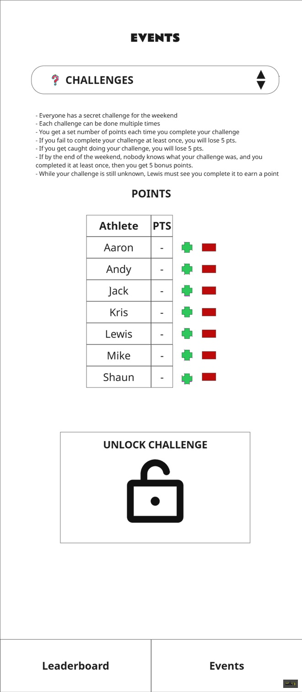

# FOOTGOLF event

## UI Mockup

## Leaderboard Consequences

Depends on specific challenges. You can gain or lose points.

## Sections

### Instructions String

>- Everyone has a secret challenge for the weekend
>- Each challenge can be done multiple times
>- You get a set number of points each time you complete your challenge
>- If you fail to complete your challenge at least once, you will lose 5 pts.
>- If you get caught doing your challenge, you will lose 5 pts.
>- If by the end of the weekend, nobody knows what your challenge was, and you completed it at least once, then you get 5 bonus points.
>- While your challenge is still unknown, Lewis must see you complete it to earn a point

### POINTS

* Table displaying points earned from challenges.
* Buttons beside each row for adding and subtracting points manually.
* Negative values allowed.
* Sort by points in descending order.
  
### UNLOCK CHALLENGE

A section locked behind a password that describes the challenge for the particular user.

The user clicks/taps the padlock icon and enters their password (assigned outside game).

Depending on the password entered, display the challenge text in the following format:

> Hello {player name}, here are the details of your challenge:
>
> Points per instance of challenge completed: {points}
> {challenge text}

Player names, points, challenge text, and passwords are stored in ../src/challenges.json.

Passwords are labeled "key" in the challenges.json array.

Passwords are used as keys to look up the correct challenge.

If the user enters an unrecognised password then the UI displays "Invalid password" and the padlock icon remains.