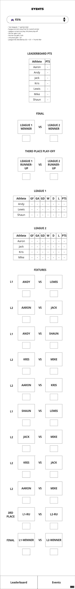

# FIFA event

## UI Mockup

## Leaderboard Consequences

The winner of the final gets 3 pts for the FIFA event in the overall leaderboard.

Final runner-up gets 2 pts.

Third place winner gets 1 pt.

## Sections

### Instructions String

>- Two leagues; 11 games total
>- League winners play final for overall winner
>- League runners-up play 3rd place play-off
>- Winner gets 3 pts
>- Runner-up gets 2 pts
>- 3rd place gets 1 pt
>- League ties decided by GD -> GF -> Thumb War

### LEADERBOARD POINTS CONTRIBUTION

* Table displaying final points after the finals have been completed
* Automatically populated based on the results of the finals.
* Only populated once the 3RD place play off or Final have a winner.

### FINAL

* UI elements to display the final head-to-head.
* Automatically populated based on the results of the fixtures.
* Only populated once all fixtures have scores entered for them.
* Input field below each player to enter score.

### THIRD PLACE PLAY-OFF

The same as for FINAL but for the third place play-off (league 1 runner-up vs. league 2 runner-up).

### LEAGUE 1

A points table containing 3 players, calculated from the scores entered in the fixtures section.

Automatic calculation and entry of:

* Goals For (GF)
* Goals Against (GA)
* Goal Difference (GF - GA)
* Wins (number of wins)
* Draws (number of draws)
* Losses (number of losses)
* Points (points tally - 3 pts for a win; 1 pt for a draw; 0 pts for a loss)

Table cells are initialised to 0.

Single click/tap athelete name in table to select player from drop down menu.

### LEAGUE 2

A points table containing 4 players. Same functionality as the league 1 table.

### FIXTURES

* A list of fixtures with UI elements displaying which player is facing which and input boxes below each player for entering the number of goals they scored in the match.
* Automatically generated from league player selections (everyone place everyone once). 
* Each fixture has a label to the left of it for the league it is for.
* The fixture score is blank until a number is entered.
* The fixture only affects the points tables when valid numbers have been entered in each goals box.
* If a goals input box for a fixture is blank or non-integer then the result and affect on the points table is not calculated and updated.
* The last two fixtures for the final and 3rd place playoff are updated with correct player names when the previous fixtures results have been entered.
* Entering results for fixtures updates the other sections: FINAL, THIRD PLACE PLAY-OFF, LEAGUE 1, and LEAGUE 2.