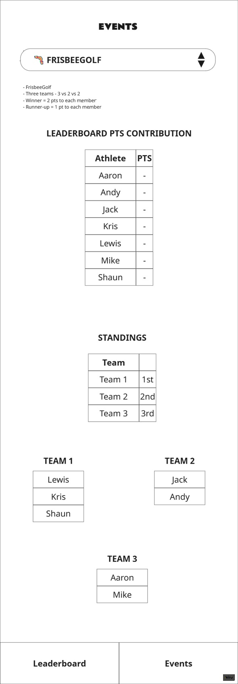

# FRISBEEGOLF event

## UI Mockup

## Leaderboard Consequences

Each member of the winning team gets 2pts.

Each member of the 2nd placed team gets 1pt.

## Sections

### Instructions String

>- FrisbeeGolf
>- Three teams - 3 vs 2 vs 2
>- Winner = 2 pts to each member
>- Runner-up = 1 pt to each member

### LEADERBOARD POINTS CONTRIBUTION

* Table displaying final points after the standings have been updated.
* Automatically populated based on the standings.
* Use the standings and teams, once configured, to allocated points to members in each team.
* Give 2pts to each member of the team in 1st position of the standings.
* Give 1pt to each member of the team in 2nd position of the standings.
  
### STANDINGS

A simple table with three rows - 1st, 2nd and 3rd place.

Each Team cell is a dropdown to select from the team names as set in the section below.

### TEAMS

Three tables, 1 for each time.

1 table of three members, and 2 tables of two members.

The team names are renamable by the admin user.

The data source for the team name drop downs in the standings table is the team names set for each table.

Each team member cell is a drop down for selecting player names.