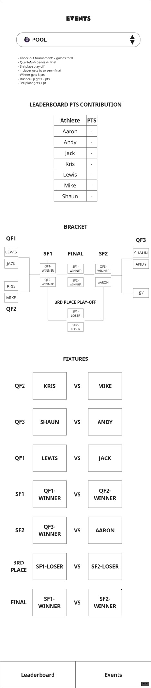

# POOL event

## UI Mockup

## Leaderboard Consequences

The winner of the final gets 3 pts for the pool event in the overall leaderboard.

Final runner-up gets 2 pts.

Third place winner gets 1 pt.

## Sections

### Instructions String

> - Knock-out tournament; 7 games total
> - Quarters -> Semis -> Final
> - 3rd place play-off
> - 1 player gets a by to the semi-final
> - Winner gets 3 pts
> - Runner-up gets 2 pts
> - 3rd place gets 1 pt

### LEADERBOARD POINTS CONTRIBUTION

* Table displaying final points after the bracket has been completed
* Automatically populated based on the results of the bracket.
* Only populated once the 3RD place play off or Final have a winner.

### BRACKET

UI elements (see mockup) displaying bracket layout and each round.

Placeholders for semi finals, final and 3rd place play-off updated with player names when winners selected for previous matches.

Double click/tap player in bracket to select as winner. Double click/tap again to deselect. Update fixture list accordingly.

For QF1, QF2, QF3, and SF2 'by' slot - single click/tap player space to select player from drop-drown. Update fixture list accordingly.

### FIXTURES

* A list of fixtures with UI elements displaying which player is facing which.
* Generated from bracket inputs.
* Each fixture has a label to the left of it for the bracket round/match.
* Double click/tap player to select winner. Double click/tap again to deselect. Update bracket accordingly.
* Updating the fixture updates the bracket. Leaderboard points contribution updated when final and 3rd round play-off match updated (the only matches that provide points to the leaderboard totals).